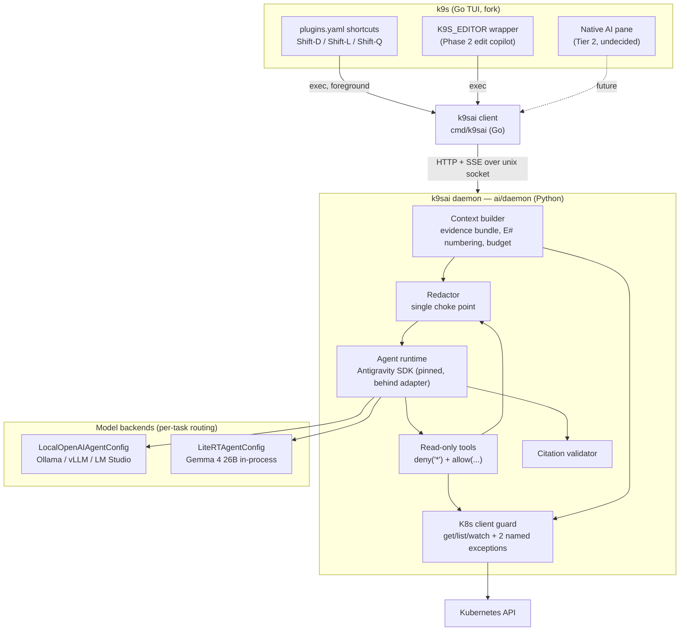

# k9sai — local AI for k9s

Status: design agreed, not yet implemented.
Scope: a personal tool, developed in the `dpuig/k9s` fork. It is not intended for upstream.

k9sai adds AI-assisted diagnosis, log summarization and syntax help to k9s. It works
through the existing plugin system, runs against a model endpoint you control, and never
mutates the cluster.

Decision records live in [`docs/adr/`](docs/adr/). This document describes *what* we are
building; the ADRs record *why*.

## Architecture



### Components

| Component | Location | Responsibility |
|---|---|---|
| Client | `cmd/k9sai/` (Go, `package main`) | Entry point for plugins. Auto-spawns the daemon if its socket is missing. Streams the response to `less -R`. Closes the connection when the pager exits, which cancels generation. |
| Daemon | `ai/daemon/` (Python ≥ 3.10) | Gathers context, redacts it, runs the agent, validates citations. Installed with `uv tool install`. Exits after 30 min idle. |
| Wire | Unix socket, mode `0600`, under `$XDG_RUNTIME_DIR/k9sai/` (fallback `~/.local/state/k9sai/`) | HTTP with SSE streaming. Debug with `curl --unix-socket`. |
| Config | `$XDG_CONFIG_HOME/k9sai/config.yaml` | Backends, per-task model routing, endpoint allowlist, evidence budget. |

`cmd/` is the cobra `package cmd`. `cmd/k9sai/` is a separate `package main`
subdirectory in the same module. It must stay thin: the socket client and pager glue only, with no
k9s `internal/` imports unless Tier 2 happens.

### Backends and routing

Both SDK backends are supported:

- **`LocalOpenAIAgentConfig(model=, base_url=)`**: Ollama, vLLM, LM Studio, or any
  OpenAI-compatible endpoint. We build and evaluate this backend first.
- **`LiteRTAgentConfig(model_path=)`**: Gemma 4 26B A4B runs inside the daemon process. It needs ≥ 24 GB of
  VRAM or unified memory and a ~16.8 GB download. Per the SDK docs, never point the OpenAI config at
  `litert-lm serve`.

Both use `.lightweight()`. The config maps each task to a backend and model, with one default:

```yaml
default: ollama-small
backends:
  ollama-small: {type: openai, base_url: http://localhost:11434/v1, model: qwen3:8b}
  gemma-local:  {type: litert, model_path: ~/models/gemma-4-26b-a4b.litertlm}
tasks:
  ask: ollama-small
  logs: ollama-small
  diagnose: gemma-local
allow_endpoints: []      # non-loopback base_urls must be listed here
budget_tokens: 6000
```

There is no automatic fallback. If the routed backend is down or out of memory, the request
fails loudly. The pager header always names the backend and model that produced the answer, so eval
results stay attributable.

The SDK (0.1.x) is pinned to an exact version and hidden behind a small internal
`AgentBackend` interface. The eval harness uses that interface with a stub model.

## Safety model

We treat the model as untrusted. Log lines, annotations and CRD fields are attacker-controllable
input (prompt injection), so the design ensures that injected instructions can reach nothing
dangerous.

### The cluster is read-only for k9sai

See [ADR-0005](docs/adr/0005-read-only-cluster-access.md).

1. **Client guard.** Every Kubernetes request goes through one wrapper that permits only
   `get`, `list` and `watch`. It rejects everything else *before* sending the request.
2. **Two named exceptions**, callable only from our own code paths and **never exposed as
   model tools**:
   - `PATCH`/`PUT` with `dryRun=All`, used by the edit copilot and by proposed fixes.
   - `SubjectAccessReview` create, used by the RBAC explainer to verify its answer.
3. **Guard test.** A test fails if any tool can reach a verb outside the allowlist, or if either
   exception can be triggered without its precondition (e.g. a PATCH without `dryRun=All`).
4. **No mutation, ever.** A proposed fix is output as a patch, the server dry-run result,
   and the exact `kubectl` command, which is copied to the clipboard. You run it yourself.

The daemon uses your own kubeconfig and the `--context` passed by the plugin. We don't
impersonate a separate read-only identity, because that needs rights that not every cluster grants. The guard
enforces read-only in our code.

### Redaction and endpoint trust

- Redaction runs in exactly one place, and every piece of evidence passes through it: the
  pre-gathered bundle *and* every tool result. It does not rely on SDK hooks.
- Secret `data`/`stringData` is never read. Tokens, private keys, connection strings, and
  bearer/basic auth headers are scrubbed. Email addresses are left intact.
- Loopback endpoints are always allowed. Any other `base_url` is refused unless it is listed
  in `allow_endpoints`, which guards against a config typo shipping prod logs to a hosted API.
- Evidence is framed to the model as quoted data, never as instructions.

## Evidence and citations

This is the hybrid evidence model ([ADR-0003](docs/adr/0003-hybrid-evidence.md)):

1. The daemon **pre-gathers** a standard bundle for the task, in priority order:
   - describe
   - events from the last hour
   - the last N lines of the current and previous container logs
   - the owner chain up to the Deployment or StatefulSet
   - node conditions
2. Every line is numbered `E1…En` and packed into `budget_tokens` in that priority order.
   Anything that doesn't fit is reported in the header.
3. The agent may make **at most 3 follow-up calls** to typed read-only tools (`get`,
   `describe`, `events`, `logs`, `node_conditions`, `rbac_lookup`) under
   `policies=[deny("*"), allow(...)]`. Tool output is redacted and appended as further
   numbered `E#` lines.
4. The model streams markdown and must tag each claim with `[E#]`.
5. After the stream ends, the **citation validator** checks every cited ID. If any are missing, it appends
   a ⚠️ footer listing the invented citations.
6. `--json` gives structured output (hypotheses, evidence IDs, fix) for the eval harness.
7. The model's reasoning stream is hidden unless `--thoughts` is passed.

The SDK docs make no promise that tool calling works on local models. Pre-gathering
guarantees a useful answer even when tool calls fail. The eval runs with tools on and
off to measure the difference per backend.

## Features

### Phase 1: plugins only

| Key | Scopes | Command | What it does |
|---|---|---|---|
| `Shift-D` | `pods`, `deployments`, `statefulsets` | `k9sai diagnose` | Ranked root-cause hypotheses citing evidence, plus a suggested fix. For a Deployment or StatefulSet, it covers the failing pods and their non-ready containers. |
| `Shift-L` | `pods`, `containers` | `k9sai logs` | `drain3` template-mines about 5k lines, and the model labels the clusters. It also shows a "new in the last 10 min" diff. |
| `Shift-Q` | `all` | `k9sai ask` | Takes a question from the plugin's input field (`$INPUT_QUERY`) and prints one k9s command with a one-line explanation, copied to the clipboard. The model is grounded in a k9s grammar cheat sheet and live namespaces, label keys and API resources. |

All three run as foreground plugins (`background: false`): k9s suspends, the output streams
into the pager, and `q` returns to k9s. Background plugins only show one flash line, which is
not enough for these outputs.

Sketch:

```yaml
# $XDG_CONFIG_HOME/k9s/plugins.yaml
plugins:
  k9sai-diagnose:
    shortCut: Shift-D
    description: AI diagnose
    scopes: [po, deploy, sts]
    command: k9sai
    background: false
    args: [diagnose, --context, $CONTEXT, -n, $NAMESPACE, --resource, $RESOURCE_NAME, $NAME]
```

`$RESOURCE_NAME` is the plural resource name (`pods`, `deployments`), not a kind, hence
`--resource`.

Shortcut caveats: `Shift-D` and `Shift-L` are unbound in the relevant resource views
(`Shift-L` is only used in the log and image-scan views). `Shift-Q` collides with the
community `plugins/ai-incident-investigation.yaml` (HolmesGPT) if that plugin is installed. Verify each
key against every scoped view during implementation.

### Phase 2: only after the Phase 1 bar is met

- **Edit copilot.** Set `K9S_EDITOR=k9sai edit`. The wrapper saves a copy of the original, opens
  the real editor (`K9SAI_EDITOR`, falling back to `$EDITOR`), diffs the result, shows the
  server dry-run result immediately, then streams the model's review of the risks (privileged containers, missing
  limits, `latest` tags, selector changes that orphan pods). It then prompts
  `[a]pply / [e]dit again / [c]ancel`, plus `[s]kip review` if the model is slow. Cancel exits
  non-zero, so `kubectl edit` discards the change. Constraints found in `internal/view/exec.go`:
  - k9s exports `K9S_EDITOR` as `KUBE_EDITOR` to **every** command it runs, and also uses it
    for plain file edits (e.g. its own config). The wrapper must recognise a `kubectl edit`
    temp file and pass everything else straight through to the real editor.
  - The wrapper doesn't receive `$CONTEXT`. It must resolve the context (for example from the parent
    `kubectl` arguments). If it can't resolve the context unambiguously, it skips the dry-run and says so.
    It must never guess.
- **RBAC explainer.** Answers "why can X do Y" by showing the binding chain, verified with a
  SubjectAccessReview. It also gives static least-privilege advice (wildcards, cluster-wide `secrets` access). Advice
  based on actual usage needs audit logs and is in the backlog.
- **CRD explainer.** Uses the OpenAPI schema and the current status. It sends only the schema subtrees at the
  paths that are set or failing, to stay within the budget.
- **Incident timeline and postmortem draft.** Built from what exists: events, Deployment and
  ReplicaSet revision history, container restart and termination timestamps, and pod start times.
  Events expire after about 1h, so gaps are labelled, not papered over. The output is a markdown postmortem skeleton.

### Later

- **Decided after Phase 1:** Tier 2 native pane (streaming overlay, inline badges) in the fork.
- **Backlog, gated on Tier 2:** Pulse anomaly narrator, inline anomaly badges, background
  precompute for CrashLoopBackOff pods (conflicts with the idle-exit daemon today).
- **Backlog:** runbook RAG, right-sizing from benchmarks, audit-log-based least-privilege
  advice, a long-term event store (e.g. Loki) for the timeline.
- **Cut:** hybrid fleet audit and the cloud planner. Multi-cluster, cloud-side planning doesn't fit a
  personal tool or the endpoint allowlist.

## Evaluation

**Phase 1 success bar:** on 20+ graded incidents, the true cause is in the top 2 hypotheses
in ≥ 70% of cases, and there are **zero** invented evidence citations.

- **Gate:** a `kind` fault-injection suite of about 10 scenarios × 2 variants: OOMKilled, bad
  image, missing ConfigMap/Secret key, failing liveness probe, unschedulable pod
  (resources/taints), crash on bad env, DNS failure, PVC stuck Pending.
- **Growth:** `k9sai capture` snapshots the evidence bundle from real failures. You hand-label
  a cause category, and the capture becomes a fixture that replays without a cluster.
- Each scenario runs with tools on and with tools off.

| Where | What runs |
|---|---|
| CI (fork's GitHub Actions) | Go tests for `cmd/k9sai`. Python unit tests: redaction, K8s guard, citation validator, drain clustering, and fixture replay against a stub `AgentBackend`. |
| Local, `make eval` | The `kind` suite and graded fixtures against the real routed models. Writes a report that gets committed, so quality is tracked over time. |

## Repository housekeeping

- `origin` is `dpuig/k9s`. Add `upstream` (`git@github.com:derailed/k9s.git`) to sync.
  New top-level `ai/` and `cmd/k9sai/` directories keep rebase conflicts rare.
- This document supersedes the earlier root-level `k9s-ai.md` proposal and its
  architecture PNG, which have been removed.
